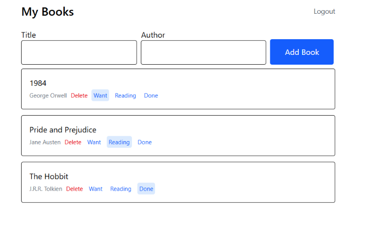

# Note Tracker FrontEnd

You can register, log in, and track your book you are reading right now. By giving status like want to read or reading or done with the book.

[Live Demo](https://book-tracker-frontend-nine.vercel.app/)



## Features

- Create and store books name and there author for the logged-in user. To track which book they are reading or want to read and done with that book.
- Delete your book, create new book, and edit existing status of the book.

## Tech Stack

Built with React and Tailwind CSS.

## What I Learned

I learned a lot about how api can call with the fetch and what are thing you can pass in crate a data in database, like method, headers and body. And how it will give a response and if it's is Ok response then you extract the json data and if it is error extract the error or pass the response status to error object.

## How to Run It Locally

```bash
git clone https://github.com/Anshuman56/book-tracker-frontend
cd book-tracker-frontend
npm install
create the .env file similar to .env.example
npm run dev
```

## Backend code

https://github.com/Anshuman56/note-auth-api
